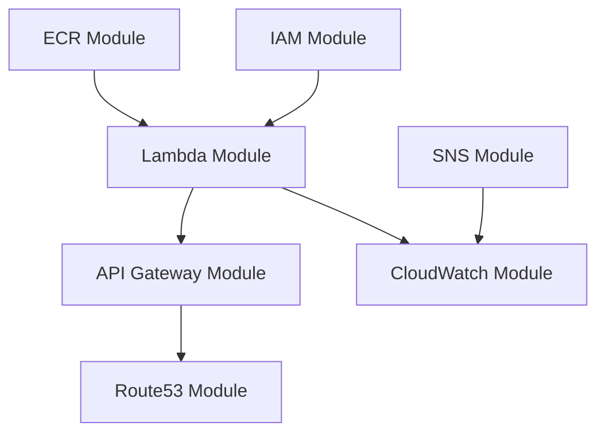

[](https://github.com/williamkoller/cloud-architecture-golang/actions/workflows/ci.yml)
[](https://github.com/williamkoller/cloud-architecture-golang/actions/workflows/deploy.yml)

# 🚀 Lambda Go com Terraform Modular na AWS

Este projeto implementa uma função **AWS Lambda** escrita em Go, empacotada como imagem Docker e provisionada automaticamente com **Terraform** usando uma **arquitetura modular**.

A ideia é simples: você escreve seu código em Go ➡ compila ➡ empacota no Docker ➡ envia para o **Amazon ECR** ➡ Terraform modular provisiona tudo na AWS de forma organizada e reutilizável.

---

## 🏗️ Arquitetura Modular

O projeto utiliza uma arquitetura Terraform modular para melhor organização, manutenibilidade e reutilização:

```
terraform/
├── main.tf                 # Orquestração dos módulos
├── variables.tf            # Variáveis globais
├── staging.tfvars         # Configurações do ambiente staging
├── production.tfvars      # Configurações do ambiente produção
└── modules/
    ├── ecr/               # Repositório de containers
    │   ├── main.tf
    │   ├── outputs.tf
    │   └── variables.tf
    ├── iam/               # Roles e políticas
    │   ├── main.tf
    │   ├── outputs.tf
    │   └── variables.tf
    ├── lambda/            # Função Lambda
    │   ├── main.tf
    │   ├── outputs.tf
    │   └── variables.tf
    ├── apigw/             # API Gateway
    │   ├── main.tf
    │   ├── outputs.tf
    │   └── variables.tf
    ├── cloudwatch/        # Logs e alertas
    │   ├── main.tf
    │   └── variables.tf
    ├── sns/               # Notificações
    │   ├── main.tf
    │   ├── outputs.tf
    │   └── variables.tf
    └── route53/           # DNS e health checks
        ├── main.tf
        ├── outputs.tf
        └── variables.tf
```

### 🔗 Dependências entre Módulos



---

## 🔄 CI/CD Pipeline

O projeto implementa um pipeline CI/CD separado e robusto:

### 📋 **CI (Continuous Integration)** - `.github/workflows/ci.yml`

**Executa em**: `push` para `main`, `develop`, `feature/*` e `pull_request` para `main`

**Jobs**:

1. **Lint & Code Quality**

   - go vet
   - gofmt (formatação)
   - Verificação de dependências

2. **Unit Tests**

   - Execução de testes unitários
   - Cobertura de código
   - Upload de relatórios

3. **Build & Docker**

   - Build da imagem Docker
   - Validação da imagem
   - Verificação do Terraform

**⚠️ Deployment só ocorre se TODOS os checks do CI passarem!**

### 🚀 **CD (Continuous Deployment)** - `.github/workflows/deploy.yml`

**Executa em**:

- Sucesso do workflow de CI na branch `main`
- Manualmente com `workflow_dispatch`

**Jobs**:

1. **Check CI Status** - Verifica se o CI passou
2. **Deploy to AWS** - Deploy completo na AWS
3. **Post-Deploy Notification** - Notificação do resultado

**Funcionalidades do Deploy**:

- ✅ Verificação de dependências do CI
- ✅ Build e push da imagem Docker
- ✅ Atualização da função Lambda
- ✅ Versionamento automático
- ✅ Configuração de alias `staging`
- ✅ Verificação pós-deploy
- ✅ Deploy manual com opção de força

---

## 📦 Ferramentas AWS Utilizadas

- **AWS Lambda** – Executa a função Go usando container images
- **Amazon ECR** – Armazena a imagem Docker da função
- **API Gateway v2** – Disponibiliza a função como uma API HTTP
- **CloudWatch Logs** – Armazena os logs da função
- **CloudWatch Alarms** – Monitora erros da Lambda
- **SNS (Simple Notification Service)** – Envia alertas configurados
- **IAM (Identity and Access Management)** – Controla permissões
- **Route53** – Health checks da aplicação

---

## 🔄 Fluxo do Projeto

1. **Desenvolvimento**: Escrevemos o código Go
2. **Build**: Compilamos o binário (`bootstrap`)
3. **Container**: Construímos a imagem Docker usando `public.ecr.aws/lambda/provided:al2`
4. **Registry**: Fazemos push para o **Amazon ECR**
5. **Infraestrutura**: O Terraform modular cria:
   - **ECR Module**: Repositório de containers
   - **IAM Module**: Roles e políticas de execução
   - **Lambda Module**: Função Lambda + alias + concorrência provisionada
   - **API Gateway Module**: HTTP API com rotas
   - **CloudWatch Module**: Logs e alarmes
   - **SNS Module**: Tópicos de notificação
   - **Route53 Module**: Health checks
6. **Deploy**: Chamamos a API e vemos a mágica acontecer ✨

---

## 📋 Pré-requisitos

- Go 1.24.5
- Docker
- AWS CLI configurado (`aws configure`)
- Terraform 1.5+
- Perfil AWS configurado (ex: `terraform-user`)

---

## ⚙️ Configuração

### 1. Configure suas variáveis de ambiente

Edite o arquivo `terraform/staging.tfvars`:

```hcl
env          = "staging"
aws_region   = "us-east-1"
account_id   = "SEU_ACCOUNT_ID"
image_tag    = "latest"
alert_email  = "seu@email.com"
aws_profile  = "terraform-user"
provisioned_concurrency = 0
```

### 2. Configure o arquivo `terraform/production.tfvars` para produção:

```hcl
env          = "production"
aws_region   = "us-east-1"
account_id   = "SEU_ACCOUNT_ID"
image_tag    = "v1.0.0"
alert_email  = "prod-alerts@empresa.com"
aws_profile  = "terraform-user"
provisioned_concurrency = 5
```

### 3. Configure secrets do GitHub Actions:

```bash
# No seu repositório GitHub, vá em Settings > Secrets and variables > Actions
# Adicione os seguintes secrets:

AWS_ACCESS_KEY_ID=SEU_ACCESS_KEY
AWS_SECRET_ACCESS_KEY=SEU_SECRET_KEY
AWS_ACCOUNT_ID=SEU_ACCOUNT_ID
```

---

## ▶️ Como Executar

### 🚀 Deploy Local (Staging)

```bash
# 1️⃣ Compilar o Go e empacotar
./deploy.sh

# 2️⃣ Navegar para o diretório terraform
cd terraform

# 3️⃣ Inicializar Terraform
terraform init

# 4️⃣ Verificar o plano
terraform plan -var-file="staging.tfvars"

# 5️⃣ Aplicar a infraestrutura
terraform apply -var-file="staging.tfvars"
```

### 🏭 Deploy via CI/CD

```bash
# 1️⃣ Fazer push para uma feature branch
git checkout -b feature/nova-funcionalidade
git add .
git commit -m "feat: adiciona nova funcionalidade"
git push origin feature/nova-funcionalidade

# 2️⃣ Criar Pull Request para main
# - O CI executará automaticamente
# - Verificará código, testes e build

# 3️⃣ Fazer merge para main
# - O CD executará automaticamente
# - Fará deploy se CI passou com sucesso
```

### 🧪 Executar Testes Localmente

```bash
# Executar todos os testes
go test -v ./...

# Executar com cobertura
go test -v -coverprofile=coverage.out ./...
go tool cover -html=coverage.out -o coverage.html

# Executar linting
golangci-lint run ./...
```

### 🧪 Testar a API

```bash
# Obter URL da API
terraform output api_gateway_url

# Testar endpoint de saúde
curl https://SEU_API_ID.execute-api.us-east-1.amazonaws.com/health

# Testar endpoint de usuários
curl https://SEU_API_ID.execute-api.us-east-1.amazonaws.com/users
```

---

## 🧹 Limpeza

```bash
# Destruir ambiente staging
terraform destroy -var-file="staging.tfvars"

# Destruir ambiente produção
terraform workspace select production
terraform destroy -var-file="production.tfvars"
```

---

## 📊 Outputs Disponíveis

Após o deploy, o Terraform fornece as seguintes informações:

- `api_gateway_url`: URL da API HTTP
- `lambda_function_arn`: ARN da função Lambda
- `lambda_function_name`: Nome da função Lambda
- `ecr_repository_url`: URL do repositório ECR
- `health_check_id`: ID do health check Route53

---

## 🔒 Segurança

- ✅ IAM roles com princípio do menor privilégio
- ✅ Logs estruturados no CloudWatch
- ✅ Alertas configurados para erros
- ✅ Health checks automáticos
- ✅ Variáveis sensíveis em `.tfvars` (não commitadas)
- ✅ Security scanning no CI
- ✅ Vulnerability scanning com Trivy

---

## 🎯 Vantagens da Arquitetura Modular

1. **Reutilização**: Módulos podem ser reutilizados em diferentes projetos
2. **Manutenibilidade**: Cada módulo tem responsabilidade específica
3. **Testabilidade**: Módulos podem ser testados independentemente
4. **Escalabilidade**: Fácil adicionar novos ambientes e funcionalidades
5. **Organização**: Código bem estruturado e fácil de navegar
6. **Collaboração**: Equipes podem trabalhar em módulos diferentes

---

## 🚦 Pipeline Status

| Workflow | Status                                                                                                                                                                                              | Descrição                   |
| -------- | --------------------------------------------------------------------------------------------------------------------------------------------------------------------------------------------------- | --------------------------- |
| CI       | [](https://github.com/williamkoller/cloud-architecture-golang/actions/workflows/ci.yml)         | Build, Test, Lint, Security |
| CD       | [](https://github.com/williamkoller/cloud-architecture-golang/actions/workflows/deploy.yml) | Deploy para AWS             |

---

## 🤝 Contribuição

1. Fork o projeto
2. Crie uma branch para sua feature (`git checkout -b feature/AmazingFeature`)
3. Commit suas mudanças (`git commit -m 'Add some AmazingFeature'`)
4. Push para a branch (`git push origin feature/AmazingFeature`)
5. Abra um Pull Request
6. Aguarde o CI passar ✅
7. Após merge, o CD fará deploy automaticamente 🚀
